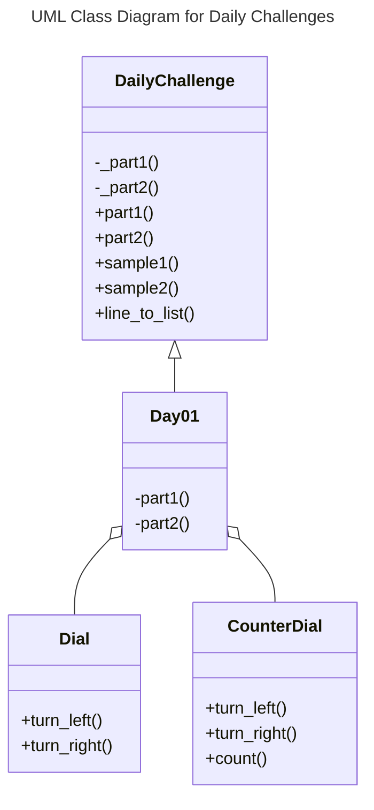

# Design

## Initial Brainstorm

* dataclass to hold data for each daily challenge
  * paths to data for Part 1, Part 2, smaller sample problems

* Or maybe it should be a Factory pattern with registry?

* add logging because I'm rusty at that skill

* add color and emojis - let's pretty print the heck out of the output

* Use ChatGPT for the cover art to save time

* The same Google Python Style Guide, `mypy`, and `pylint` stuff we use at work.

* Anything to reinforce the design patterns we teach in class would be great...

* Use `pyproject.toml` and make it installable as a module run with `-m`

* Add `argparse` controls
  * default: run all daily challenges
  * flags to limit to just certain day(s) or real challenge vs mini sample
  * logging/debug flag

## Class Design

It's an open question whether every day will have sample data for both Part 1
and Part 2 plus just a single large set of real challenge data. For now, here
is the class design:

`DailyChallenge` is an Abstract Base Class for which each day must implement
the abstract methods `_part1` and `_part2`. Results are accessed via the
getters/properties `part1`, `part2`, `sample1`, and `sample2`.

The challenges for any given day may also involve helper classes, but in past
years, such helpers are not often re-used from one day to the next. The main
exception to this rule is that your parser that reads in challenge data is
often reusable from day to day. *Caveat:* The structure of the data varies:
sometimes each line is a single item; othertimes an individual element is
delimited by a comma, whitespace, etc.

## Timeline

* [x] Days 1-2 - rough draft-y code; install dev dependencies

* [-] Days 3-5 - finalize `DailyChallenge`, its factory, and unittest format
  * [-] Add cover art to README once the overall theme is clearer

* [-] Days 6-11 - do the challenges; clean up linting and type checking

* [-] Day 12 - revise docs, doublecheck pylint, mypy, etc.
